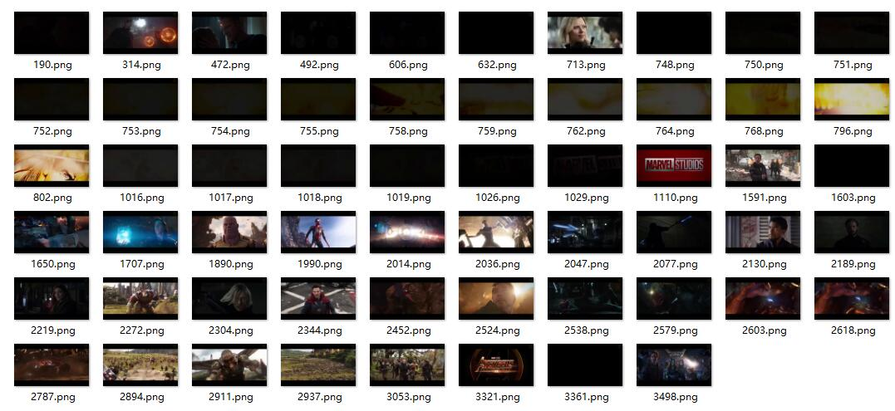
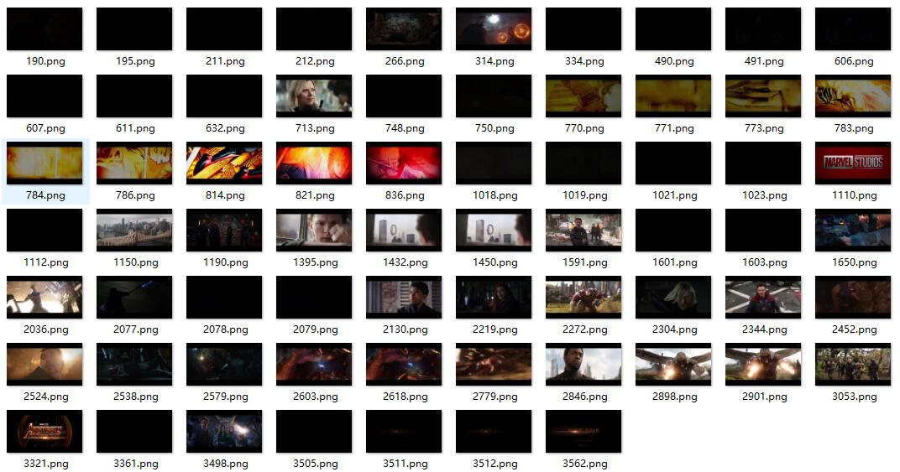
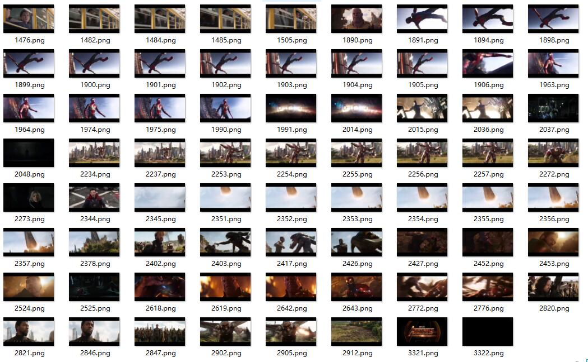
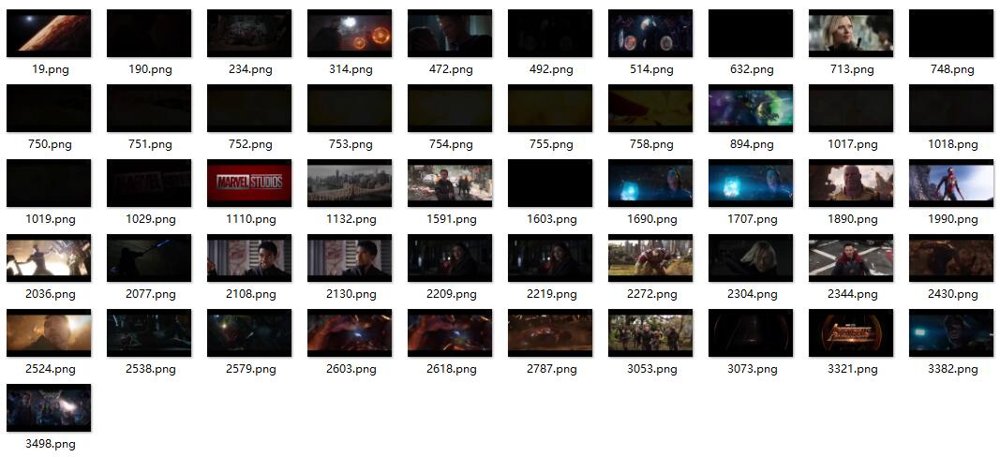

# Video-Shot-Detection
- Video shot detection in four algorithms: **Histogram Intersect, Moment Invariant(Humoment), Motion Vector(Optical Flow), Twin Comparison(Based on Histogram)**.
- Input: video clip (or a sequence of decoded images)
- Output: frame number at which the lens switch occurs (lens **mutation** and lens **gradient**) 
## Usage
- Video Material：movie.mp4
- Histogram Intersect
	- Input in cmd: `python color_hist.py`
	- Output: images in `similarResult` folder
- Moment Invariant 
 	- Input in cmd: `python humoment.py`
	- Output: images in `humomentDetectResult` folder
- Motion Vector
	- Input in cmd: `python opt_flow.py`
	- Output: images in `optResult` folder
- Twin Comparison
	- Input in cmd: `python twin_comparison.py`
	- Output: images in `HistTwinComparisonResult` folder
## Result
Result based on my own parameters for these algorithms.

Histogram Intersect (Accuracy 75.80%, Recall 69.84%)

Moment Invariant (Accuracy 67.26%, Recall 71.43%)

Motion Vector(Accuracy 34.57%, Recall 58.73%)

Twin Comparison Based on Histogram(Accuracy 34.57%, Recall 57.14%)

